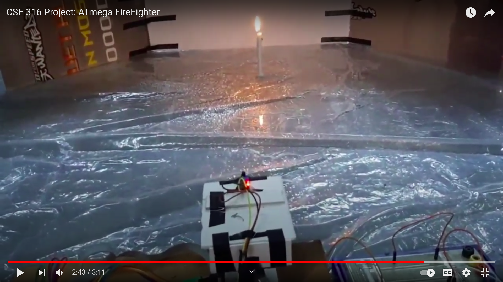

# ATmega FireFighter

This is an ATmega32-based project done as the term project of CSE 316: Microcontrollers, Microprocessors and Embedded Systems sessional course. Me and my project collaborators ([imtial](https://github.com/imtial) & [shahrarswapnil](https://github.com/shahrarswapnil)) developed this system to constantly search for fire incidents in its surveillance area. In case of a fire incident, it alerts the place owner or the corresponding authorities via mobile phone SMS from an emergency number and extinguishes the fire by throwing water directly to the fire source.

### Video Demonstration (click)

### Basic Hardware Components
1. ATmega32 Microcontroller
2. Flame Sensor
3. Servo Motor
4. DC Motor
5. GSM module
6. LCD Module

### Used ATmega32 Features
1. ADC
2. PWM
3. UART

### What This Repository Includes
1. Code for detecting fire, servo movement, extinguishing fire, showing info on LCD module
2. Code for GSM module
3. A detailed HTML report on the project
